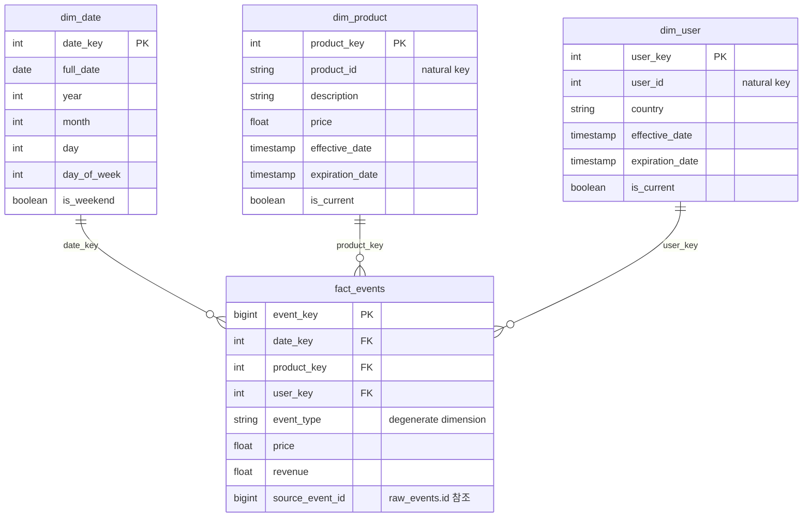

# 차원 모델 ERD (ADR 0008)

Star Schema. `fact_events`가 사실 테이블, `dim_date`/`dim_product`/
`dim_user`가 차원 테이블이다. `dim_product`, `dim_user`는 Type 2 SCD로
이력을 보존한다(`is_current`, `effective_date`, `expiration_date`).

## 왜 이런 형태인지 (adrs/0008-dimensional-modeling.md 참고)

- **그레인(grain)**: `fact_events`는 `raw_events` 1건당 1행이다.
  `event_type`이 view/search/add_to_cart/purchase/refund일 때
  전부 이 하나의 테이블에 담긴다. `revenue`는 `purchase`일 때만
  값을 가지고 나머지는 0이다 — 이렇게 하면 퍼널 분석(조회→구매
  전환)과 매출 분석을 같은 테이블로 처리할 수 있다.
- **Type 2 SCD**: `dim_product.price`가 바뀌면 기존 행을
  `is_current=false`로 만료시키고, 새 `product_key`로 새 행을
  추가한다. `fact_events`는 적재 시점에 "그때 현재였던" 버전의
  키를 가리키므로, 나중에 가격이 바뀌어도 과거 거래는 그 시점
  가격으로 정확히 남는다.
- **degenerate dimension**: `event_type`은 별도 차원 테이블 없이
  `fact_events`에 그대로 둔다. 값의 종류가 적고(7종) 자체로
  분석 축이 되기 때문에 굳이 분리하지 않았다.
